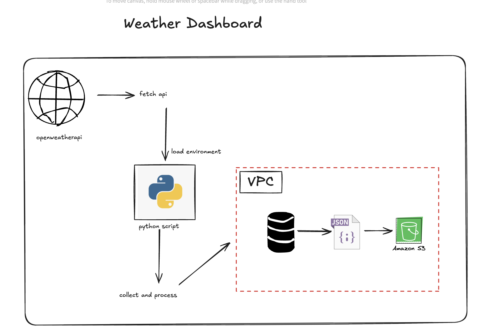

# Project Title

This is a project from the #DevOpsAllStarChallenge 🚀. This is the day1 project. Got 29 more projects to complete. The application is about collection data about the weather api and storing it inside an s3 bucket for easy retrieval.

## Technical Requirements:

We need an API client (e.g., requests) to interact with the weather API.
Python Programming Language for backend.
An S3 bucket for long-term storage of the data.

## System Design



## Installation

Install my-project with uv.

```bash
uv venv day-env --python 3.11
source day-env/bin/activate
uv pip install -r requirements.txt
```
